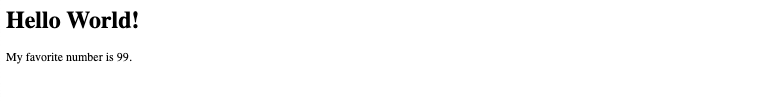

# [Web Application Development](https://gitlab.msu.edu/cse477-fall-2023/course-materials/): Homework 0


## Purpose

The goal of this assignment is to install, configure, and obtain access to all of the tools that you will be required to use for the remainder of the course. More specifically, this assignment will step you though:

1. How to access the online lectures.
2. How to submit your homework assignments.
3. How to ask questions about homework assignments.
4. How to deploy a simple web application on your machine for development.
5. How to deploy a live application to the world wide web using Google Cloud.


## Homework Instructions

### Youtube

1. Navigate to the course's [Youtube Channel](https://www.youtube.com/channel/UCYGBs23woNtXUSl6AugHNXw)
2. [Optionally] click the Subscribe button on the top-right of the page. This should keep you informed if/when new lecture materials are posted.


### Gitlab

##### Access and Configure your MSU Gitlab Account

1. Navigate to [MSU's Gitlab](https://gitlab.msu.edu/)
2. Sign into Gitlab using your MSU `netID` and password.
3. If you are unable to sign into MSU's Gitlab, please email `ithelp@msu.edu` requesting Gitlab access and and be sure to CC me (`ghassem3@msu.edu`).


##### Access the Course's Gitlab Group

1. Navigate to the [Course Gitlab Page](https://gitlab.msu.edu/cse477-fall-2023)

2. On the page, you should see two project rows: 

   * (1) `course-materials` 
   * (2) a project with the same name as you `netID`.

   The `course-materials` project is where we will store the materials and assignments for the class. The project with the same name as your `netID` is where you will upload and submit your assignments for the class.

3. Please make sure that you can access both projects by clicking them. Note that the project with your `netID` should be empty.

    

##### Explore the Course Materials:

1. Navigate to the [Course Materials Repository](https://gitlab.msu.edu/cse477-fall-2023/course-materials)
2. Note that the repository contains a few directories and a `README.md` file, which is displayed automatically on the page.
3. The `homework` directory contains instructions and templates for Homework assignments. 


##### Clone Course Materials and Your Personal Course Repository

1. Clone a copy of the <u>course materials repository</u> to your local machine by running the following command from the terminal:
   - `git clone https://gitlab.msu.edu/cse477-fall-2023/course-materials.git`
2. Clone a copy of your <u>Personal Course Repository</u> to your local machine by running the following command from the terminal:
   - `git clone https://gitlab.msu.edu/cse477-fall-2023/<YOUR-NET-ID>.git`
   - Note that the above command assumes you will swap out `<YOUR-NET-ID>` for your actual `netID` value.

 

##### Practice Replying to Gitlab Issues

1. General announcements in this course, along with Q&A will be performed through Gitlab's Issue's functionality. To begin, you will practice how to respond to Gitlab issues.

2. From the [Course Materials Page](https://gitlab.msu.edu/cse477-fall-2023/course-materials), Click the Issues option on the left-side panel.

3. Notice that there is one open issue called `Homework 0: Introduce yourself`.

4. Click the open issue and respond to the instructions provided in the issue. **Do not close the issue**.

5. A common issues post for each homework will be maintained and updated as the semester progresses. Make sure to go through it before posting a new issue. The common issues post for Homework-0 is located here: https://gitlab.msu.edu/cse477-fall-2023/course-materials/-/issues/8

   

##### Create and Delete a Gitlab issue

1. From the [Issues Page](https://gitlab.msu.edu/cse477-fall-2023/course-materials/-/issues), create a new issue by clicking the `New issue` button in the top-right corner.
2. Provide a Title and Description. Be sure to include an appropriate value for the labels  `Labels` field.
3. Edit your issue by clicking the pen icon to the right of the issue's title.
4. Delete your issue by clicking the red delete button. If delete option is not visible due to limited gitlab rights, then make sure to close any  issues that you created which don't need the Instructors or Teaching Assistants response.   


### Google Cloud

##### Request education credits coupon

As part of this course, you will obtain some hands-on experience publishing live web applications using Google Cloud. Google has generously provided everyone in the class with $25 in cloud credits to get you started. 

Here's how to obtain them: 

1. [Click here to request your $25 Google Cloud coupon.](https://vector.my.salesforce-sites.com/GCPEDU?cid=LoG5D0CH4GQMhuv4M2B58oNQTdZEbc4he9DQmT%2B2xOgiuDirXlC%2B8d8v0XS6nR6w/)

2. When registering **use your @msu.edu address**. 

3. A confirmation email will be sent to you with a coupon code.


##### Redeem your education credits

You must have a Google account to use education credits. If you don't have a Google account, you can [create one here](https://accounts.google.com/signup). 

1. To redeem a coupon, open the coupon email from Step 1 and click **Redeem now**, or click the button below Cloud Console. If you're not already signed in to your Google account, you are prompted to sign in.

2. The Cloud Console opens to a confirmation screen. If the coupon code isn't automatically entered, copy the code from the email (where it says **Your code**) into the Cloud Console under **Coupon code**.

   

##### Enable account billing

1. [Log into the Google Cloud Console](https://console.cloud.google.com).
2. Navigate to [GCP's Storage Page](https://console.cloud.google.com/storage) and click **ENABLE BILLING** in the banner near the top of the page.

2. Select "*Billing Account for Education*" as the Billing Account. 

   

##### Install Google Cloud SDK

To allow for deployment of your web application from the command line, we will be using Google Cloud's SDK. The specific steps needed to install the SDK on your environment depend on your operating system.

1. [Please see here for instructions on how to install the latest Cloud SDK on your machine.](https://cloud.google.com/sdk/docs/quickstart#mac)

With the Google Cloud SDK installed, you should now be able to interact with the cloud from your command line.


#####  Initialize the Google Cloud SDK

 From the command line of your machine, run the command below; when prompted to provide a project name, use `cse477-fall-2023`:

```
gcloud init
```


### Docker

We'll be using Docker, a containerization tool, to help set up your environment for each of the homework assignments.  We'll be covering what Docker is, and why it's useful for application development a little later in the semester. For now, just trust me when I say it will save us from lots of annoying system configuration work and let you focus on web app development!

##### Install Docker

1. Install Docker by visiting https://docs.docker.com/get-docker/ and following the instructions for your operating system.


### Web App Deployment

Now that we have our directories all set up, and our tools all installed, it's finally time to deploy the web application. We're going to try deploying the template app in Homework-0 both locally, as well as to Google Cloud. 


##### Copy Homework 0 materials into your Personal Course Repository

1. From the course materials repository, copy the `homework/Homework-0` directory into your <u>Personal Course Repository</u>. The directory contains several files that create a very simple web application. Don't worry about the contents of the directory just yet - our first goal here is just to make sure you have the tools needed to deploy web applications. 


##### Deploy your web application locally 

1. Navigate to the `Homework-0` directory of your <u>Personal Course Repository</u> (that's the one with the same name as your netID). 

2. Use `docker-compose` to host the web application locally by executing the following command from a terminal:

	```bash
	docker-compose -f docker-compose.yml -p hw0-container up
	```
	
	When this command completes you will should see an output like this:
	
	```bash
	flask-app_1  |  * Serving Flask app 'flask_app' (lazy loading)
	flask-app_1  |  * Environment: development
	flask-app_1  |  * Debug mode: on
	flask-app_1  |  * Running on all addresses.
	flask-app_1  |    WARNING: This is a development server. Do not use it in a production deployment.
	flask-app_1  |  * Running on http://192.168.176.2:8080/ (Press CTRL+C to quit)
	flask-app_1  |  * Restarting with stat
	flask-app_1  |  * Debugger is active!
	flask-app_1  |  * Debugger PIN: 474-660-581
	```
	
3. Open a new terminal window and run the following command to make sure the container was successfully created.

  ```bash
  docker ps
  ```

  You should see an output that looks something like this;

  ```bash
  CONTAINER ID   IMAGE                     COMMAND                  CREATED          STATUS          PORTS                    NAMES
  9c09a09fc83f   hw0-container   "/bin/sh -c 'exec py…"   30 seconds ago   Up 29 seconds   0.0.0.0:8080->8080/tcp   hw0-container_flask-app
  ```


##### Access the local web application through the browser

At this point, you have successfully launched the template web application on your local machine. You can view the web application at the following address on your browser: [0.0.0.0:8080](http://0.0.0.0:8080). The browser should show you a simple page that looks like this:




**Edit the web application, live.**

The  web application I've provided can be edited live, and you will see updates to the webpage as you make these edits. Try making an edit and seeing things change.

1. Within the `Homework-0` directory, open [flask_app/routes.py](flask_app/routes.py) in your preferred text-editor.
2. Change the value of the `count` variable on line 5 to another value (e.g. 25) and edit the string that is being returned on line 6; <u>save the file</u>.
3. Refresh [the web application in your browser](http://0.0.0.0:8080/). You should see your changes.


**Debug errors, live.**

As you are learning, coding and experimenting with your web applications, you will probably introduce bugs. I've configured the web application so that any errors will show up on the main page of the web application itself. This should make your debugging a lot easier. 

1. Within the `Homework-0` directory, open [flask_app/routes.py](flask_app/routes.py) in your preferred text-editor.

2. Introduce an error to line 5, for instance, add some extra white space before the `count` variable.

3. Save and refresh [the web application in your browser](http://0.0.0.0:8080/). Your web browser will return the Error, and provide the stack trace to help you debug.

4. Fix the error, and refreshl!

   

**Deploy your web application to Google Cloud**

Deploy your Dockerized App to Google Cloud by running the commands below; <u>enable any services you are prompted about</u>. Note that "cse477-fall-2023" in the commands below refer to your projects ID which could possibly be different. If its different, change the commands to reflect the correct project to deploy to. You can read more about it in the common issues post for Homework-0 here: https://gitlab.msu.edu/cse477-fall-2023/course-materials/-/issues/8  

```bash
gcloud builds submit --tag gcr.io/cse477-fall-2023/homework
gcloud run deploy --image gcr.io/cse477-fall-2023/homework --platform managed
```

* When prompted for service name, press enter.
* When prompted for the `region` choose `us-central1`
* When prompted regarding `unauthenticated invocations` choose  `y`

when the application has completed deploying, it will provide provide an output like this:

```bash
Deploying container to Cloud Run service [homework] in project [cse477-fall-2023] region [us-central1]
✓ Deploying new service... Done.                                            
  ✓ Creating Revision...                                                    
  ✓ Routing traffic...                                                      
  ✓ Setting IAM Policy...                                                   
Done.                                                                       
Service [homework] revision [homework-00001-qol] has been deployed and is serving 100 percent of traffic.
Service URL: https://homework-z7tywrhkpa-uc.a.run.app
```

 The last line in the above output is the <u>Service URL</u>; You can visit the <u>Service URL</u> above to see a live version of your web application. You can also [shut down the web app](https://console.cloud.google.com/run?project=cse477-fall-2023) from the Google Cloud Console.


**Pruning, stopping and restarting Docker Images**

Docker images can take up a lot of space and memory if left running (on your local machine). It's good practice to stop your Container, and/or remove images (running on your local machine) after you've launched your application to the web. When you're done with your homework. 


To remove images and containers:

```bash
docker system prune -a
```


To stop a particular container:

```
docker stop hw0-container_flask-app
```


To start a particular container:

```
docker start hw0-container_flask-app
```


## Submitting your assignment

##### Submit Homework 0 Code

1. Submit your assignment by navigating to the main directory of your <u>Personal Course Repository</u> and Pushing your repo to Gitlab; you can do this by running the following commands:

   ```bash
   git add .
   git commit -m 'submitting Homework 0'
   git push
   ```

2. You have now submitted Homework 0; you can run the same commands to re-submit anytime before the deadline. Please check that your submission was successfully uploaded by navigating to the corresponding directory in Personal Course Repository online.


##### Submit Homework 0 Service URL:

[Submit the Service URL for your live web application in this Google Form](https://docs.google.com/forms/d/e/1FAIpQLSfZsZgrMfVy23jMeUNLv5-c832ys-fvTwEmwEJrPoctFbwE9Q/viewform). 


